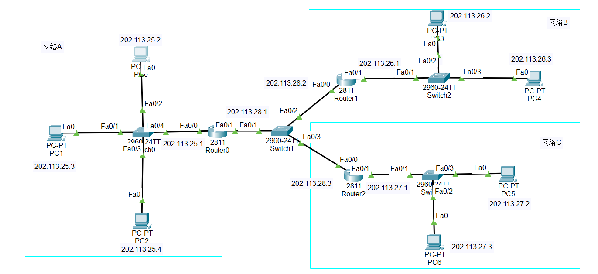
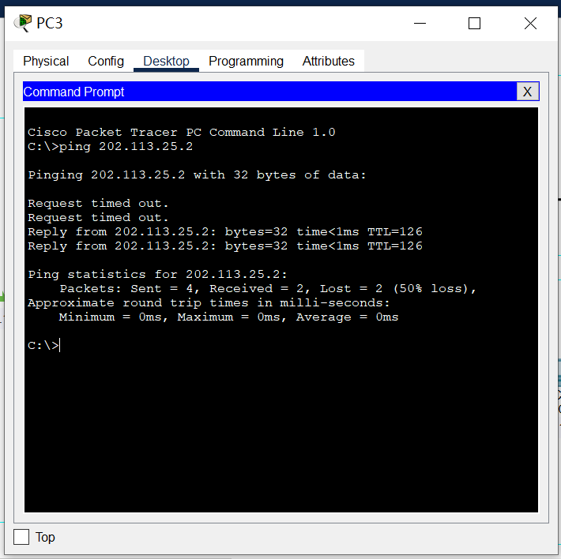
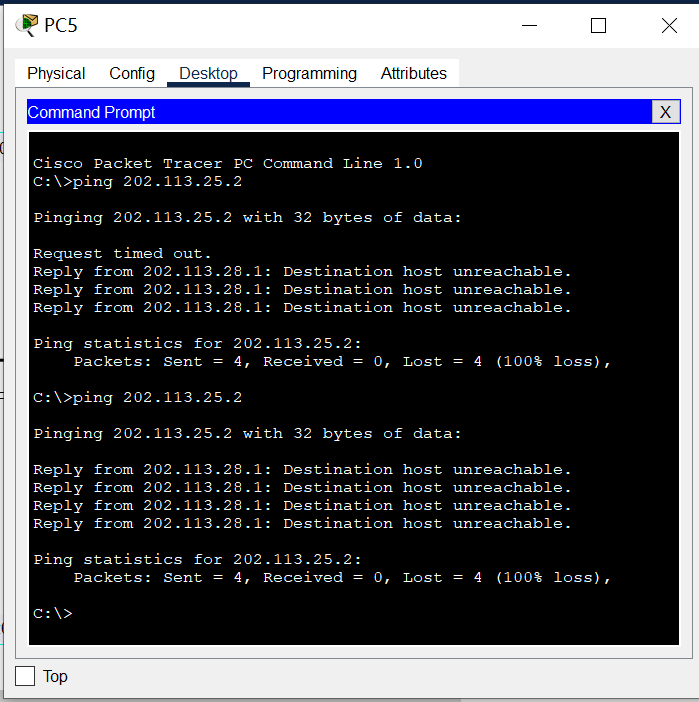
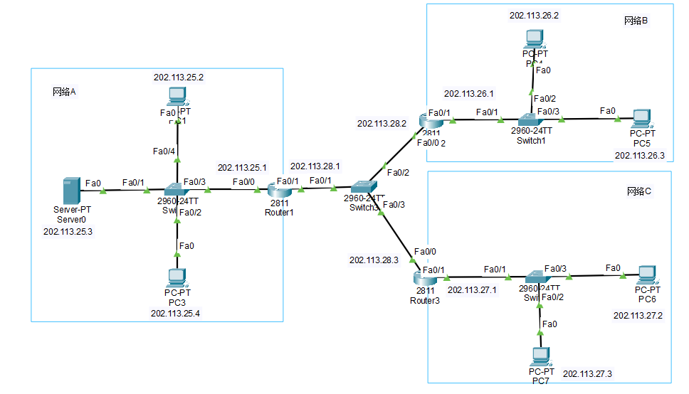
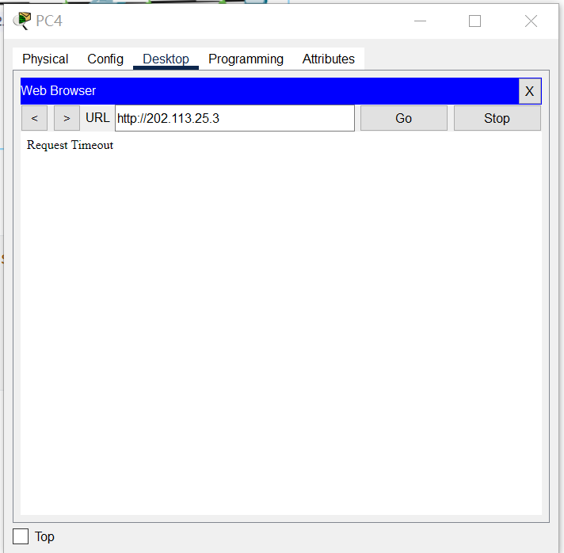
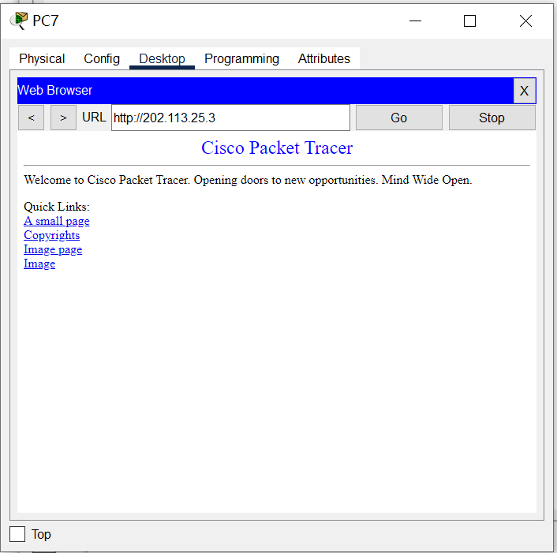
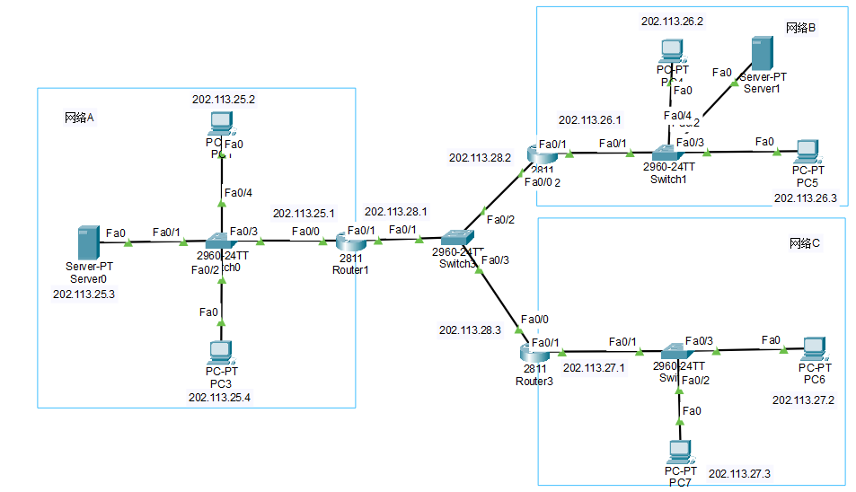
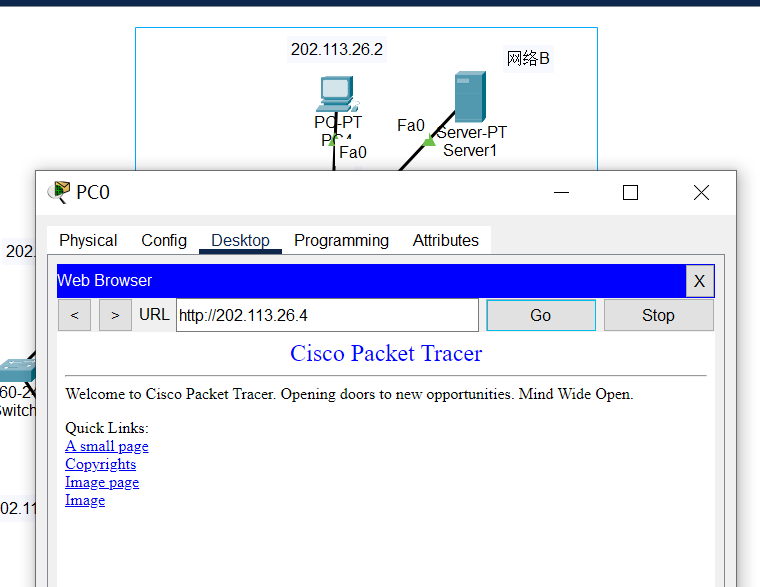
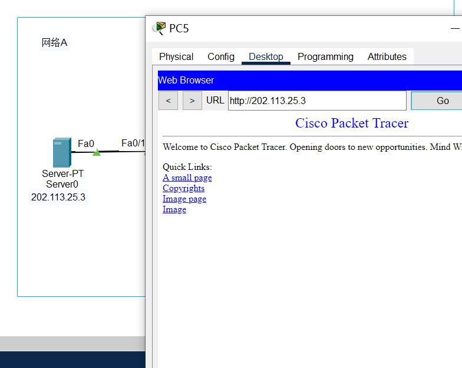

# 实验7：防火墙和SSL实验

[TOC]

## 实验要求

> 1. 防火墙实验
>
> 防火墙实验在虚拟仿真环境下完成，要求如下：
>
> （1）了解包过滤防火墙的基本配置方法、配置命令和配置过程。
>
> （2）利用标准ACL，将防火墙配置为只允许某个网络中的主机访问另一个网络。
>
> （3）利用扩展ACL，将防火墙配置为拒绝某个网络中的某台主机访问网络中的Web服务器。
>
> （4）将防火墙配置为允许内网用户自由地向外网发起TCP连接，同时可以接收外网发回的TCP应答数据包。但是，不允许外网的用户主动向内网发起TCP连接。
>

## 实验环境

> 操作系统：Windows10
> 软件版本：Cisco Packet Tracer_820_windows_64bits

## 实验内容

### 1、防火墙实验

网络拓扑结构如下所示：



添加路由器R1的访问控制列表

```cmd
Router(config)#access-list 6 permit 202.113.26.0 0.0.0.255
Router(config)#access-list 6 deny any
Router(config)#interface fa0/1
Router(config-if)ip access-group 6 in
```

使用主机PC3ping主机PC0：



使用主机PC5pingPC0:



### 2、扩展ACL

网络拓扑图如下所示：



添加路由器R1的扩展访问列表

```cmd
Router(config)#access-list 106 deny tcp host 202.113.26.2 host 202.113.25.3 eq
80
Router(config)#access-list 106 permit ip any any
Router(config)#interface fa0/1
Router(config-if)ip access-group 106 in
```

使用PC4访问服务器：



使用PC7访问服务器：



实验验证成功。

### 3、ACL自反

网络拓扑结构如下所示：（相较于扩展ACL，在网络B增加一个服务器）



配置路由器R1

```cmd
Router(config)#ip access-list extended aclout
Router(config ext-nacl)#permit tcp any any
Router(config ext-nacl)#exit
Router(config)#ip access-list extended aclin
Router(config-ext-nacl)#permit tcp any any established
Router(config ext-nacl)#exit
Router(config)#interface GigabitEthernet0/0/1
Router(config-if)#ip access-group aclout out
Router(config-if)#ip access-group aelin in
```

使用PC0访问网络B中的服务器：



使用PC5访问网络A中的服务器：



## 实验心得

通过本次实验了解防火墙的基本原理、功能和工作方式。学习了如何根据特定网络需求配置防火墙规则、访问控制列表（ACL）、安全策略等，确保网络安全性。
