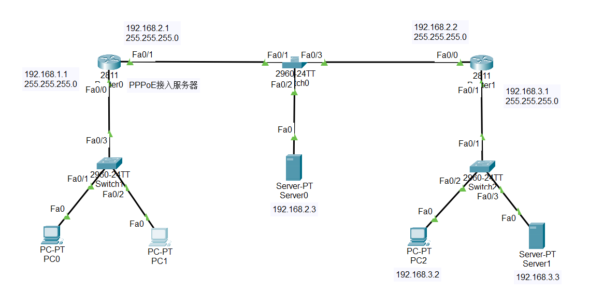
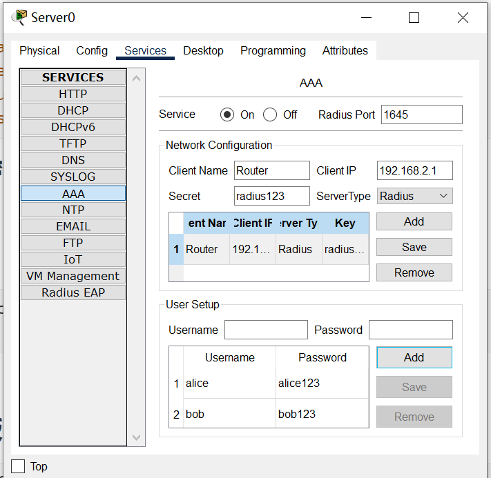
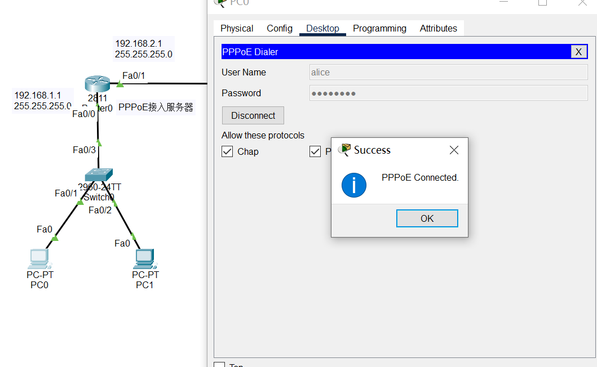
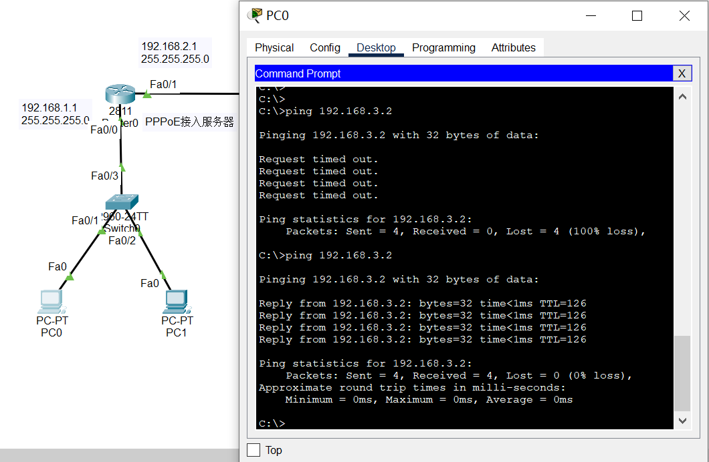
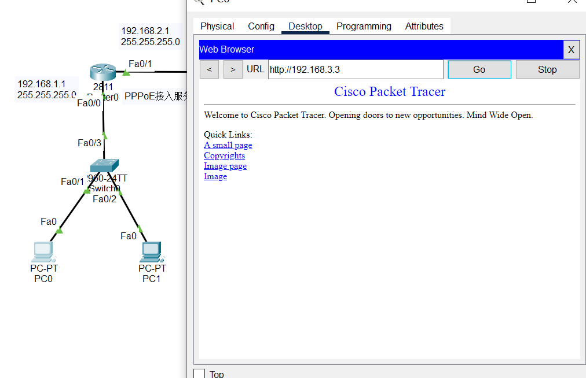
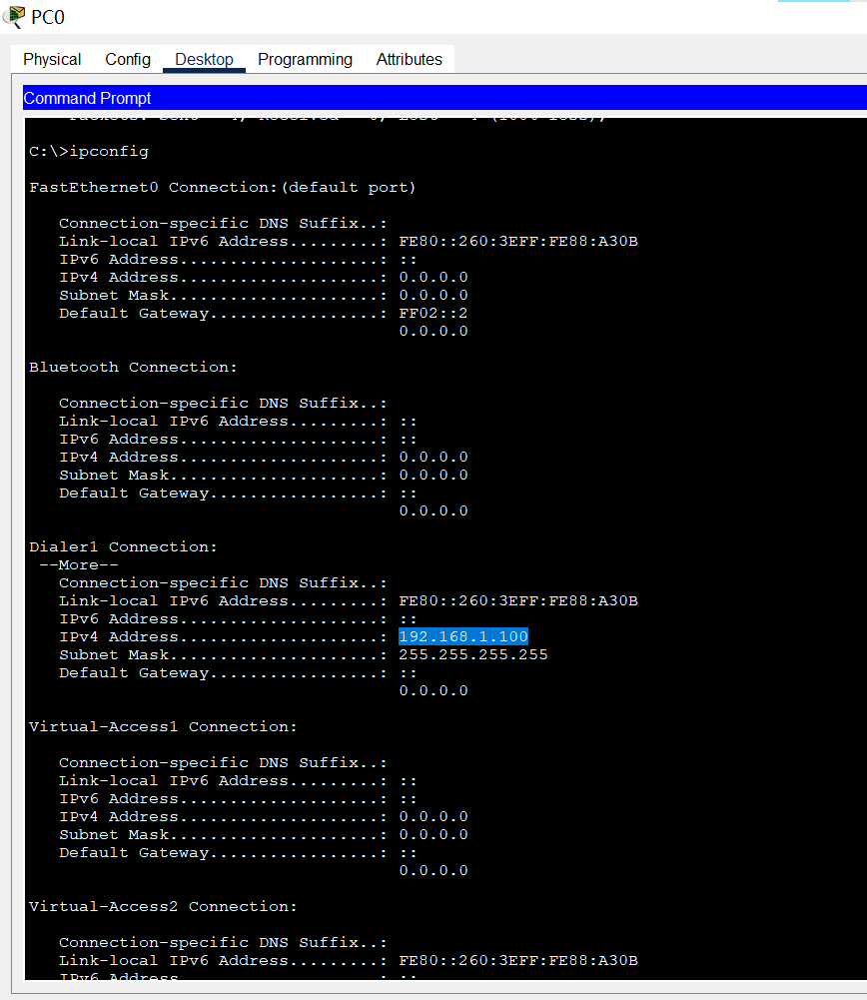

# 实验8：PPPoE服务器的配置和应用

## 实验要求

> 1. PPPoE服务器配置和应用实验在虚拟仿真环境下完成，要求如下：
>
>    （1）仿真有线局域网接入互联网的场景，正确配置PPPoE服务器的认证协议、地址池、虚拟模板和物理接口，使内网用户经认证后才能正常访问外部互联网。
>
>    （2）仿真家庭网络中，无线和有线终端（主机、智能电话等）连入小型路由器，由小型路由器统一接入互联网服务运营商PPPoE服务器的场景。对小型路由器和PPPoE服务器进行设置，使家庭网络中的用户经认证后才能正常访问外部互联网。
>

## 实验环境

> 操作系统：Windows10
> 软件版本：Cisco Packet Tracer_820_windows_64bits

## 实验内容

网络拓扑结构如下：



**配置路由器的本地AAA认证**

```cmd
Router(config)#aaa new-model
Router(config)#aaa authentication ppp myPPPoE group radius
Router(config)#radius-server host 192.168.2.3 auth-port 1645 key radius123
```

**配置接入用户的用户名与密码**



**建立本地地址池**

```cmd
Router(config)#ip local pool myPool 192.168.1.100 192.168.1.200
```

**配置虚拟接口模板**

```cmd
Router(config)#interface virtual-template 1
Router(config-if)#ip unnumber fa0/0
Router(config-if)#peer default ip address pool myPool
Router(config-if)#ppp authentication chap myPPPoE
```

**创建BBA组**

```cmd
Router(config)#bba-group pppoe myBBAGroup
Router(config-bba)#virtual-template 1
```

**配置物理接口**

```cmd
Router(config)#interface fa0/0
Router(config-if)#pppoe enable group myBBAGroup
```

配置成功，使用PC0接入PPPoE服务：



使用PC0 ping PC2：



PC0浏览服务器：



ipconfig查看分配的IP地址：



实验验证成功。
