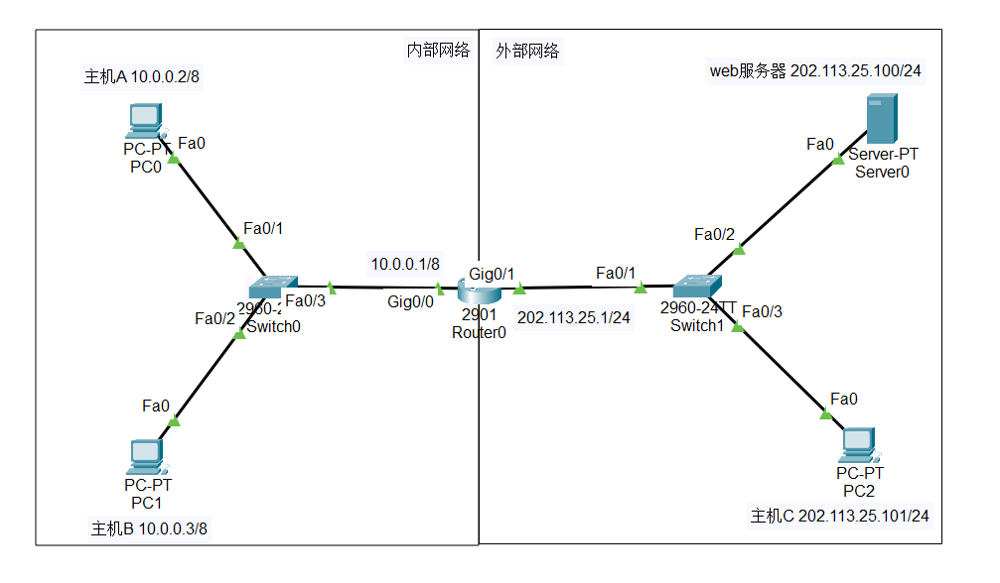
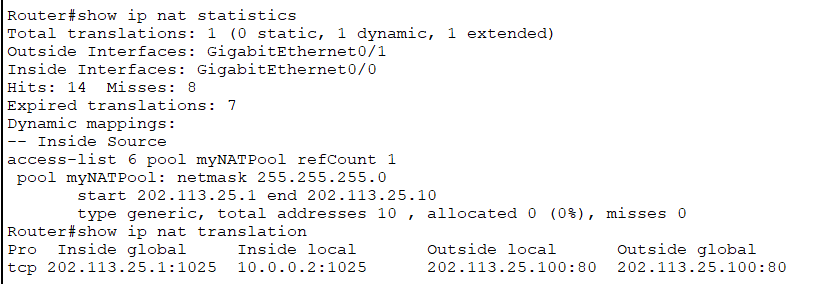
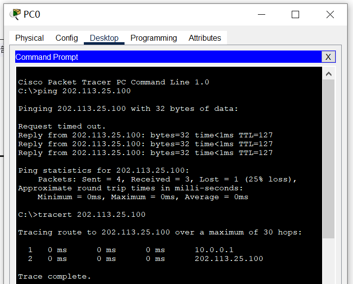
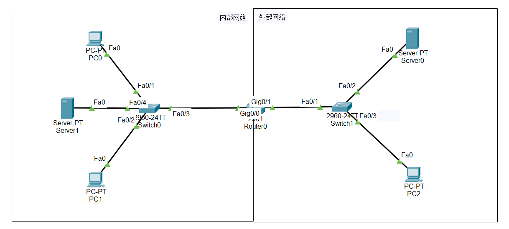
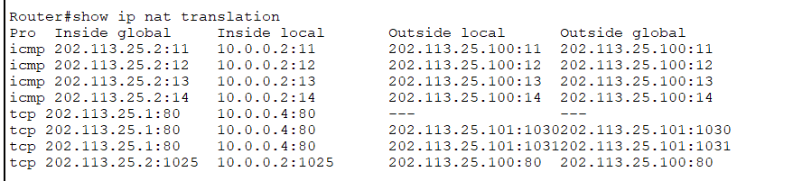
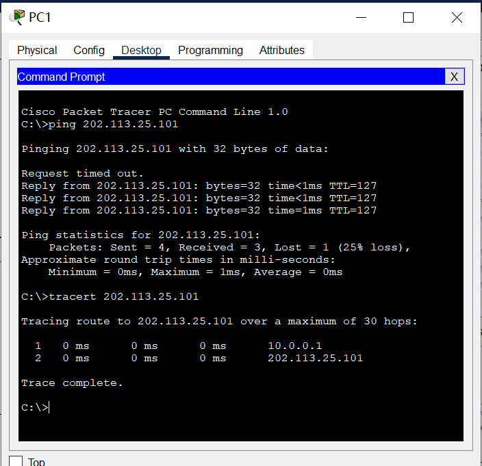
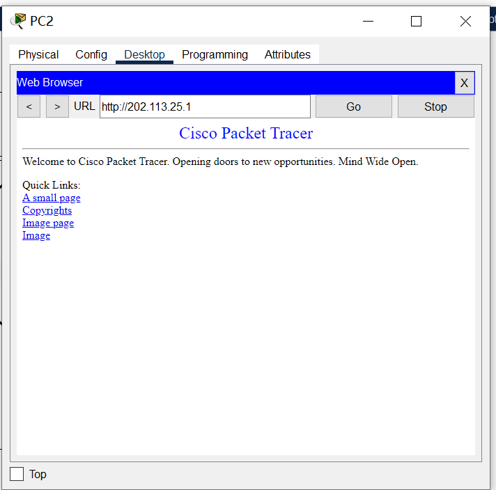
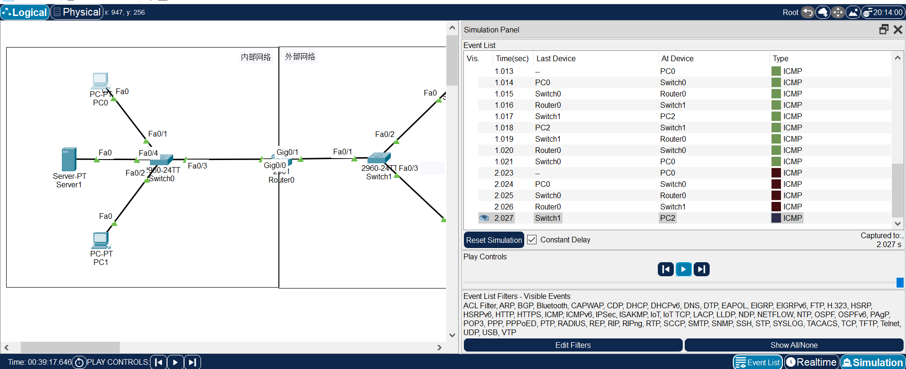
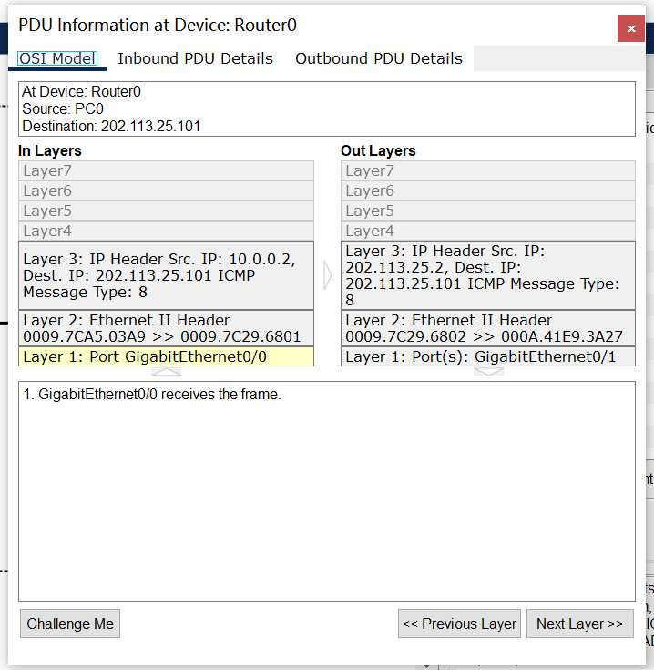

# 实验六：NAT的配置

[TOC]

## 实验要求

> 1. 仿真环境下的NAT服务器配置
>
> 在仿真环境下完成NAT服务器的配置实验，要求如下：
>
> （1）学习路由器的NAT配置过程。
>
> （2）组建由NAT连接的内网和外网。
>
> （3）测试网络的连通性，观察网络地址映射表。
>
> （4）在仿真环境的“模拟”方式中观察IP数据报在互联网中的传递过程，并对IP数据报的地址进行分析。
>
> 2. 在仿真环境下完成如下实验
>
> 将内部网络中放置一台Web服务器，请设置NAT服务器，使外部主机能够顺利使用该Web服务。

## 实验环境

> 操作系统：Windows10
> 软件版本：Cisco Packet Tracer_820_windows_64bits

## 实验内容

#### 仿真环境下的NAT服务器配置

最终网络结构如下所示：



Router1

```CMD
Router>enable
Router#config terminal
Router(config)#interface Gig0/0
Router(config-if)#ip address 10.0.0.1 255.0.0.0
Router(config-if)#no shutdown
Router(config-if)#exit
router(config)##interface Gig0/1
Router(config-if)#ip address 202.113.25.1 255.255.255.0
Router(config-if)#no shutdown
```

本实验使用IP地址如下：

| 设备          | IP地址         | 子网掩码      |
| ------------- | -------------- | ------------- |
| 主机A         | 10.0.0.2       | 255.0.0.0     |
| 主机B         | 10.0.0.3       | 255.0.0.0     |
| 主机C         | 202.113.25.101 | 255.255.255.0 |
| 外部Web服务器 | 202.113.25.100 | 255.255.255.0 |

建立路由器地址池并且设置内网与外网指令如下：

Router1

```CMD
Router>enable
Router#config terminal
Router(config)#ip nat myNATPool 202.113.25.1 202.113.25.10 netmask 255.255.255.0
Router(config)#access-list 6 permit 10.0.0.0 0.255.255.255
Router(config)#ip nat inside source list 6 pool myNATPool overload
Router(config)#interface Gig0/0
Router(config-if)#ip nat inside
Router(config-if)#exit
router(config)##interface Gig0/1
Router(config-if)#ip nat outside
```

网络映射表如下：



配置成功后，使用PC0 ping 外网服务器：



内网访问外网服务器：


#### 在内网添加一台web服务器

网络结构如下所示：



网络设置与上以实验相同，此处不赘述。

为使外网主机能够访问内网服务器，使用命令添加外网访问内网的接口：

```cmd
Router>enable
Router#config terminal
Router(config)#ip nat inside source static tcp 10.0.0.4 80 202.113.25.1 80
```

网络映射表如下：



测试主机连通性：



外网主机访问内网服务器：



#### 在模拟方式中观察数据包传递过程

由于两个实验的数据包模拟传递过程相同，因此只进行一次描述，以下图的网络结构为例：


由主机PC0向PC2发送数据包：



观察到数据包正确投递：



在路由器转发数据包的过程中，观察到会由NAT将内网IP地址转换为统一的外网IP地址后再进行转发。

实验验证成功。

## 实验心得

通过本次实验了解NAT是如何工作的，了解到NAT是一种用于在私有网络和公共网络之间映射IP地址。学习NAT允许多个设备共享一个公共IP地址，从而减轻了IPv4地址的压力。并且在数据包传递过程中观察私有IP地址是如何映射到公共IP地址的，以及如何维护转换表。
