# 实验4：互联网组网与路由器配置

[TOC]

## 实验要求

>1. 实体环境下互联网组网与路由器配置
>
>在实体环境下完成互联网组网与路由器配置，要求如下：（1）在机房实验室环境下，通过将局域网划分为不同子网，用多IP主机作为路由器，组建互联网。（2）在命令行方式下，按照静态路由方式，配置路由器和主机，测试互联网的连通性。
>
>2. 仿真环境下的互联网组网与路由器配置
>
>在仿真环境下完成互联网组网与路由器配置，要求如下：（1）学习路由器的配置方法和配置命令。（2）参考实体实验，组建由多个路由器组成的互联网。物理网络可以由集线器、交换机构成。（3）按照静态路由方式配置路由器和主机，测试互联网的连通性。（4）利用动态路由方式配置路由器和主机，测试互联网的连通性。（5）在仿真环境的“模拟”方式中观察数据包在互联网中的传递过程，并进行分析。

## 实验环境

> 操作系统：Windows10
> 软件版本：Cisco Packet Tracer_820_windows_64bits

## 实验内容

### 实体环境下互联网组网与路由器配置

网络结构如下：

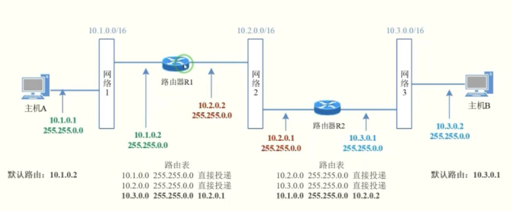

为避免同一机房中实验主机的IP发生混淆，本实验使用IP地址与路由表如下：

| 设备     | IP地址      | 子网掩码    |
| -------- | ----------- | ----------- |
| 主机A    | 192.101.0.1 | 255.255.0.0 |
| 主机B    | 192.103.0.2 | 255.255.0.0 |
| 路由器R1 | 192.101.0.2 | 255.255.0.0 |
| 路由器R1 | 192.102.0.2 | 255.255.0.0 |
| 路由器R2 | 192.102.0.1 | 255.255.0.0 |
| 路由器R2 | 192.103.0.1 | 255.255.0.0 |

R1路由表：

| 目标地址    | 子网掩码    | 下一跳      |
| ----------- | ----------- | ----------- |
| 192.101.0.0 | 255.255.0.0 | 直接投递    |
| 192.102.0.0 | 255.255.0.0 | 直接投递    |
| 192.103.0.0 | 255.255.0.0 | 192.102.0.1 |

R2路由表：

| 目标地址    | 子网掩码    | 下一跳      |
| ----------- | ----------- | ----------- |
| 192.101.0.0 | 255.255.0.0 | 192.102.0.2 |
| 192.102.0.0 | 255.255.0.0 | 直接投递    |
| 192.103.0.0 | 255.255.0.0 | 直接投递    |

对四台主机分别进行配置后，为路由器主机添加路由表项，启动路由器主机的route and remote access服务，关闭两台主机的防火墙。分别使用ping命令与tracert命令：

结果如下：

主机A：

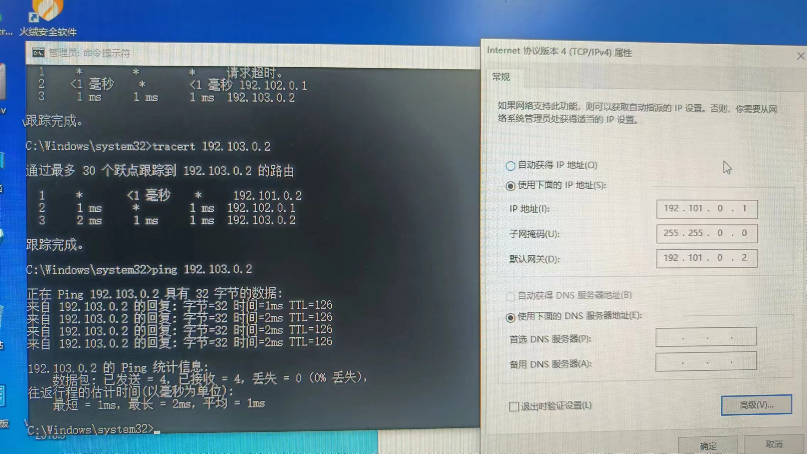

路由器R1：

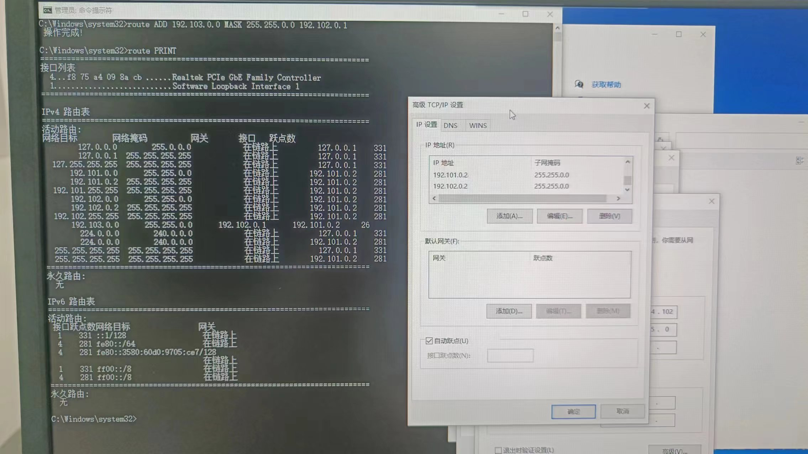

路由器R2：

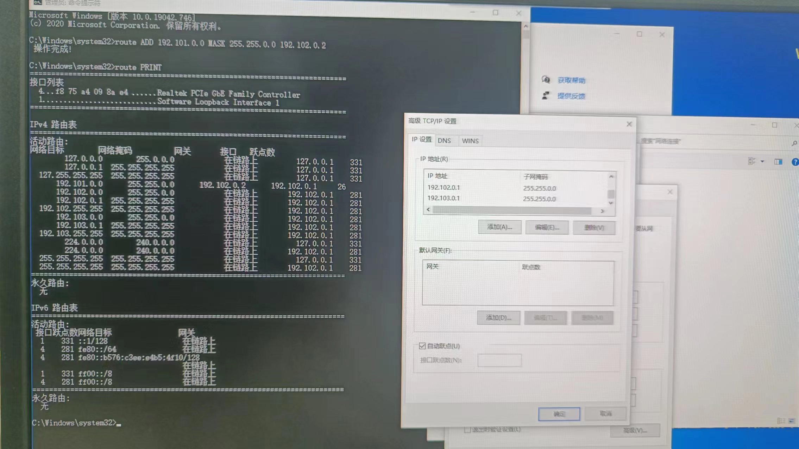

主机B：

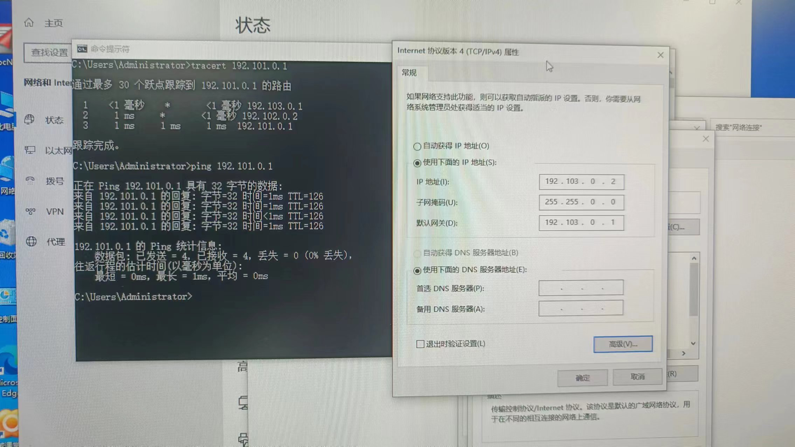

试验成功。

命令投递过程如下：

1. 主机A向主机B发送ping命令；
2. 数据包投递到路由器R1；
3. 路由器R1查询自身路由表项，将目的IP地址与子网掩码相与后得出网络号，查询到对应表相后，选择下一跳地址与接口；
4. 路由器R2收到数据后，查询自身路由表项后，选择直接投递，投递给主机B；
5. 主机B收到数据包后，将回复数据包返回给路由器R2；
6. 路由器R2收到数据包后，查询自身路由表项，将目的IP地址与子网掩码相与后得出网络号，查询到对应表相后，选择下一跳地址与接口；
7. 路由器R1收到数据后，查询自身路由表项后，选择直接投递，投递给主机A；
8. 主机A收到回复，一次数据包传输回复完毕。

### 仿真环境下的互联网组网与路由器配置

#### 静态路由

最终网络结构如下图：

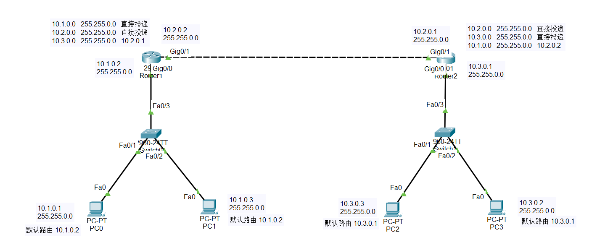

为两台路由器配置接口Gig0/0和Gig0/1的IP地址：

Router1

```CMD
Router>enable
Router#config terminal
Router(config)#interface Gig0/0
Router(config-if)#ip address 10.1.0.2 255.255.0.0
Router(config-if)#no shutdown
Router(config-if)#exit
router(config)##interface Gig0/1
Router(config-if)#ip address 10.2.0.2 255.255.0.0
Router(config-if)#no shutdown
```

Router2

```CMD
Router>enable
Router#config terminal
Router(config)#interface Gig0/0
Router(config-if)#ip address 10.3.0.1 255.255.0.0
Router(config-if)#no shutdown
Router(config-if)#exit
router(config)##interface Gig0/1
Router(config-if)#ip address 10.2.0.1 255.255.0.0
Router(config-if)#no shutdown
```

接下来配置路由器的静态路由：

```CMD
Router(config)#ip route 10.3.0.0 255.255.0.0 10.2.0.1
```

```cmd
Router(config)#ip route 10.1.0.0 255.255.0.0 10.2.0.2
```

配置完成后，使用命令`show ip route`查看路由表：

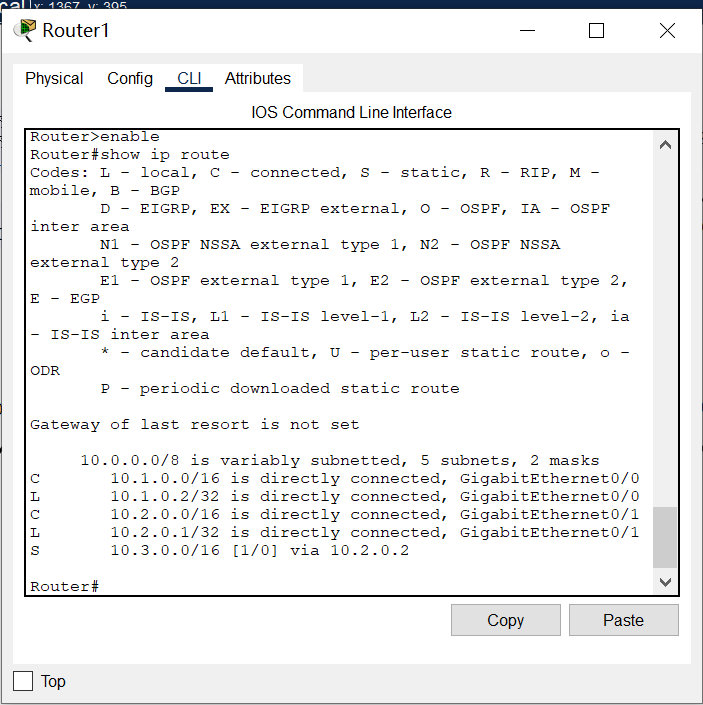

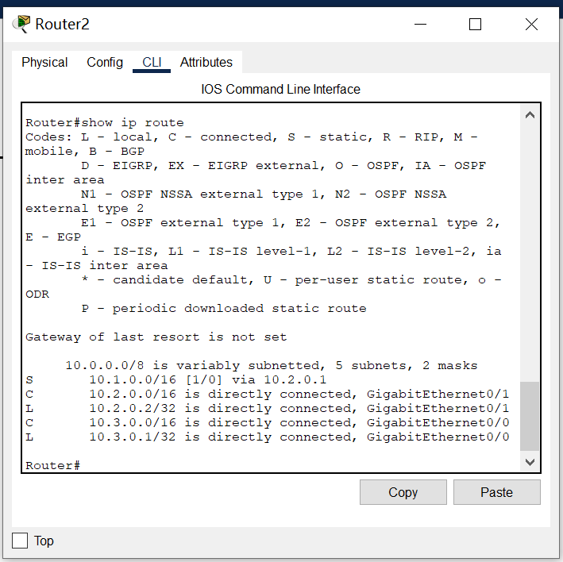

此时，测试网络连通性，使用主机PC0向目的主机PC2发送ping命令和tracert命令：

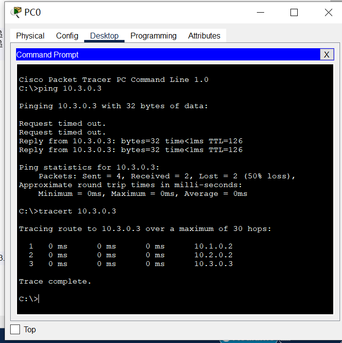

仿真模拟结果如下：

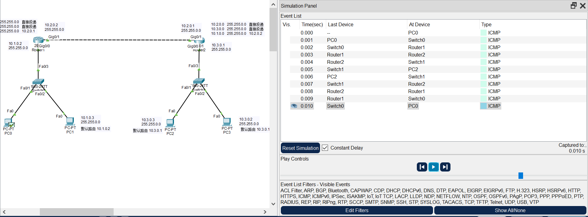

数据包顺利从源主机发送到目的主机中，完成一次ping命令。

#### 动态路由

最终网络结构如下图所示：

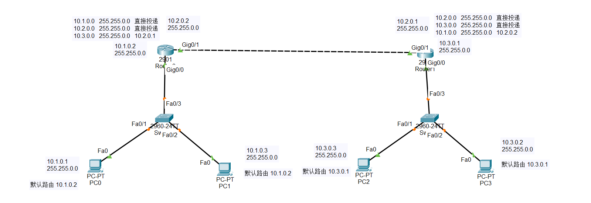

网络结构和配置端口IP地址过程与静态路由相同，但我们使用配置RIP的方式使其获取路由：

router1：

```cmd
Router>enable
Router#config terminal
Router(config)#router rip
Router(config-router)#version 2
Router(config-router)#network 10.1.0.0
Router(config-router)#network 10.2.0.0
```

router2:

```cmd
Router>enable
Router#config terminal
Router(config)#router rip
Router(config-router)#version 2
Router(config-router)#network 10.2.0.0
Router(config-router)#network 10.3.0.0
```

查看路由表:

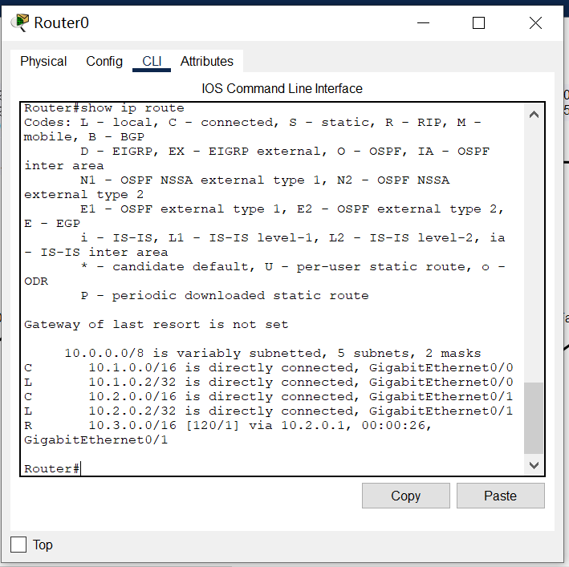

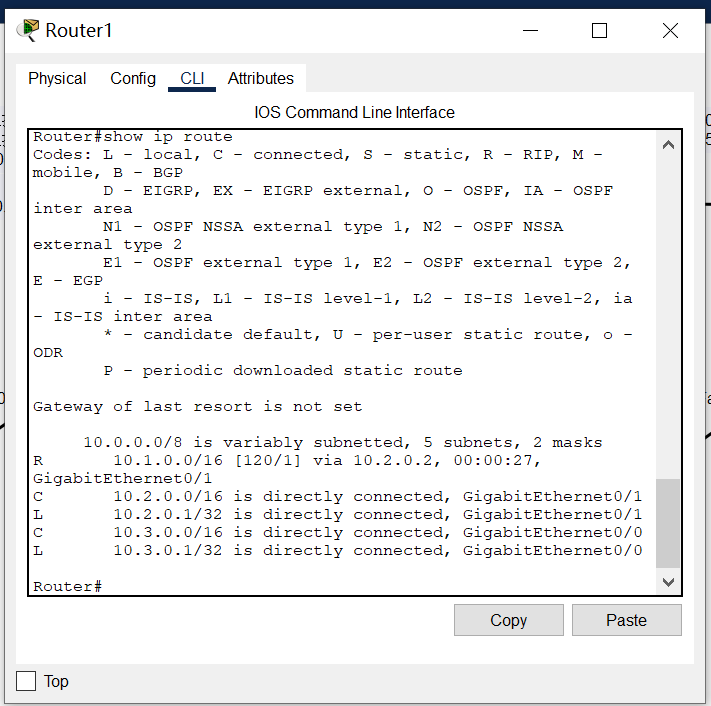

此时，验证网络连通性，结果如下：

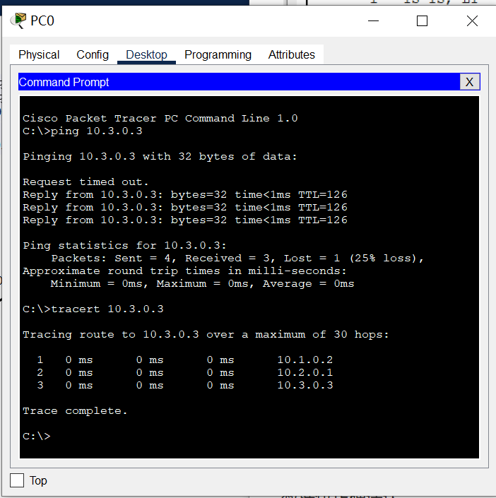

仿真模式结果如下：

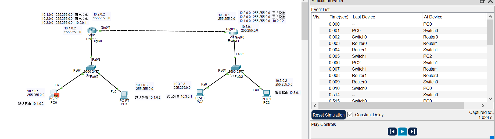

数据包正确送达。

在实验过程中，观察数据包中的目的MAC与源MAC地址，目的IP与源IP地址的变化：

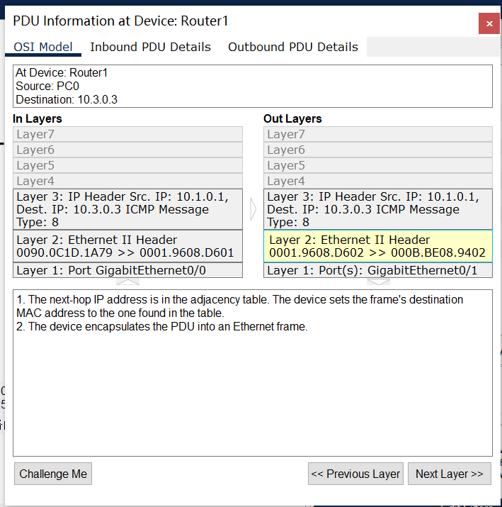

以上图为例，可知在数据包传输过程中目的IP与源IP地址是不变的，但目的MAC与源MAC地址地址会随着数据包发送与接收变化为各个主机与路由器接口的MAC地址。

## 实验心得

通过本次实验配置仿真环境，理解了不同的网络拓扑，培养了对网络结构和拓扑的直观理解。实践动态路由协议RIP，进一步加深了对RIP协议的理解。